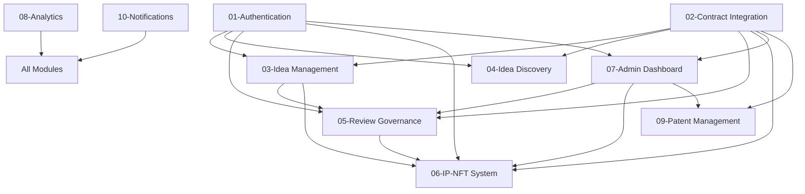

# Spark Frontend Implementation - Master Overview

## 📋 Critical Implementation Requirements

### **🚨 Contract Address Management - MANDATORY**

**All modules MUST use smart contract addresses from the `networkInfo` context provided by `serverConfig.ts`. Never use hardcoded addresses.**

```typescript
// ✅ CORRECT - Use networkInfo context
import { useNetworkInfo } from '@/hooks/useNetworkInfo';

const { networkInfo, loading, error } = useNetworkInfo(); // From serverConfig.ts
const contractAddress = networkInfo?.sparkIdeaRegistry;

// ❌ WRONG - Never hardcode addresses
const contractAddress = '0x1f3474D7a0a83b8eBdf544FE8EaA64BA5f4725eD';
```

### **🌐 Current Deployment**

**All Spark contracts are currently deployed on Base Sepolia testnet.**

The `networkInfo` context provides access to these contract addresses:
- `sparkIdeaRegistry` - Core idea management
- `governorResearch` - Governance voting
- `attestationVault` - NDA attestations
- `sparkIpNft` - IP-NFT minting
- `copyleftIpPool` - Copyleft licensing
- `mintIpNft` - NFT minting executor
- `fundAndMintIpNft` - Funded minting
- `sparkBridge` - Cross-chain bridge

---

## 🗂️ Implementation Modules

### **Core Infrastructure**
- **[01-authentication-nda-system.md](./01-authentication-nda-system.md)** - NDA attestation and access control
- **[02-contract-integration.md](./02-contract-integration.md)** - Smart contract hooks using networkInfo

### **User Features**
- **[03-idea-management.md](./03-idea-management.md)** - Idea submission with DocuSign NDAs
- **[04-idea-discovery.md](./04-idea-discovery.md)** - Browsing and search
- **[05-review-governance.md](./05-review-governance.md)** - Review system and governance

### **Advanced Features**
- **[06-ip-nft-system.md](./06-ip-nft-system.md)** - IP-NFT minting and licensing
- **[07-admin-dashboard.md](./07-admin-dashboard.md)** - Platform administration
- **[08-analytics-reporting.md](./08-analytics-reporting.md)** - Analytics and metrics
- **[09-patent-management.md](./09-patent-management.md)** - Patent tracking
- **[10-notification-integration.md](./10-notification-integration.md)** - Real-time notifications

---

## 🔧 Implementation Rules

1. **Use `useNetworkInfo()`** - All contract addresses come from this hook
2. **Base Sepolia Network** - Current deployment target
3. **NDA-Based Access** - All content requires proper NDA attestation
4. **Existing PoSciDonDAO Integration** - Leverage existing infrastructure
5. **DocuSign Integration** - Idea-specific NDAs for enhanced security

Remember: Always use `networkInfo` for contract addresses. The system automatically handles network configuration and contract deployment addresses.

---

## 🚨 Critical Implementation Requirements

### **ABSOLUTE RULES - NO EXCEPTIONS**
1. **USE EXISTING CODEBASE**: Leverage all existing PoSciDonDAO frontend infrastructure
2. **MAINTAIN CONSISTENCY**: Follow established design patterns and coding conventions
3. **SECURITY FIRST**: Implement proper NDA-based access control throughout
4. **MODULAR APPROACH**: Each module should integrate seamlessly with others

---

## 🗂️ Implementation Order

### **Phase 1: Foundation (Weeks 1-2)**
1. **Authentication & NDA System** - Critical for all other modules
2. **Contract Integration** - Required for all blockchain interactions

### **Phase 2: Core Features (Weeks 3-4)**
3. **Idea Management** - Core user functionality
4. **Idea Discovery** - Essential for platform usability

### **Phase 3: Governance (Weeks 5-6)**
5. **Review & Governance** - Enables platform decision-making
7. **Admin Dashboard** - Required for platform management

### **Phase 4: Advanced Features (Weeks 7-8)**
6. **IP-NFT System** - Monetization and IP protection
9. **Patent Management** - IP tracking and protection

### **Phase 5: Enhancement (Weeks 9-10)**
8. **Analytics & Reporting** - Platform optimization
10. **Notification Integration** - User experience enhancement

---

## 🔗 Cross-Module Dependencies



---

## 📊 Module Complexity & Priority

| Module | Priority | Complexity | Dependencies | Est. Time |
|--------|----------|------------|--------------|-----------|
| 01-Authentication | 🔴 Critical | High | None | 1-2 weeks |
| 02-Contract Integration | 🔴 Critical | Medium | 01 | 1 week |
| 03-Idea Management | 🟠 High | Medium | 01, 02 | 1 week |
| 04-Idea Discovery | 🟠 High | Low | 01, 02 | 0.5 weeks |
| 05-Review Governance | 🟠 High | High | 01, 02, 03 | 1-2 weeks |
| 07-Admin Dashboard | 🟡 Medium | Medium | 01, 02, 05 | 1 week |
| 06-IP-NFT System | 🟡 Medium | High | 01, 02, 03, 05 | 1-2 weeks |
| 09-Patent Management | 🟢 Low | Low | 01, 02, 03 | 0.5 weeks |
| 08-Analytics | 🟢 Low | Medium | All others | 1 week |
| 10-Notifications | 🟢 Low | Low | All others | 0.5 weeks |

---

## 🎨 Design System Consistency

### **Shared Components Across Modules**
- **AccessGate** - NDA verification wrapper (Module 01)
- **ProtectedButton** - Action buttons with access control (Module 01)
- **StatusBadge** - Consistent status indicators (Module 02)
- **LoadingSpinner** - Unified loading states (Module 02)
- **ErrorBoundary** - Consistent error handling (Module 02)

### **Shared Utilities**
- **useAttestationVault** - NDA attestation management (Module 01)
- **useSparkContracts** - Contract interaction hooks (Module 02)
- **useEncryption** - Content encryption/decryption (Module 01)
- **useNotifications** - Notification management (Module 10)

---

## 🚀 Getting Started

1. **Review Existing Codebase**: Understand current PoSciDonDAO frontend structure
2. **Start with Module 01**: Authentication & NDA system is the foundation
3. **Follow Implementation Order**: Respect dependencies between modules
4. **Test Integration**: Ensure each module integrates with existing platform
5. **Maintain Consistency**: Every component should feel native to the platform

---

## 🔧 Development Environment Setup

### **Required Tools**
- Node.js 18+
- Next.js (existing version)
- TypeScript (existing configuration)
- Ethers.js (existing version)
- Existing PoSciDonDAO frontend setup

### **Smart Contract Addresses (Polygon Mainnet)**
```typescript
export const SPARK_CONTRACTS = {
  sparkIdeaRegistry: '0x1f3474D7a0a83b8eBdf544FE8EaA64BA5f4725eD',
  governorResearch: '0x965BAd9a732A5F817c81604657a8A9B4c54A7D19',
  sparkBridge: '0x54559a3DDf30a2fdECfCD4cF9A201305F05abD08',
  sparkIpNft: '0x71474Ba393e2189CADbf8256FB196CAB36470c53',
  copyleftIpPool: '0x5aAc191fF483781AF11290F8D33A0587c76C4bee',
  mintIpNft: '0x2E6e33D89953c1323Bfd5776666c566b65bF00c3',
  fundAndMintIpNft: '0xc8DE74F46DfC70Ecd59c66975CBaAb86d91a87D9',
  actionCloneFactoryResearch: '0xeD8181d7D14cBa402A3F773D18580392693C77cF',
  attestationVault: '0x[TO_BE_DEPLOYED]'
};
```

---

## 📝 Documentation Standards

Each module documentation includes:
- **Overview & Objectives**
- **Technical Requirements**
- **Component Specifications**
- **Implementation Examples**
- **Integration Points**
- **Testing Guidelines**
- **Deployment Instructions**

---

## 🎯 Success Metrics

### **Technical Metrics**
- Zero regression in existing PoSciDonDAO functionality
- 100% NDA attestation verification coverage
- Secure encryption/decryption pipeline
- < 3s page load times for all Spark features

### **User Experience Metrics**
- Seamless integration with existing platform navigation
- Intuitive NDA signing flow (< 2 clicks from prompt to signed)
- Clear access control feedback (users understand why content is restricted)
- Consistent design language with existing platform

### **Security Metrics**
- No unauthorized access to protected content
- Proper key management and distribution
- Complete audit trail for all access attempts
- Regular security assessments passed

---

Remember: This modular approach allows for focused development while maintaining system coherence. Each module builds upon previous ones while contributing to the overall Spark platform vision. 

## ✅ **Summary**

This documentation provides a streamlined approach to implementing the Spark frontend:

1. **Always use `useNetworkInfo()`** for contract addresses
2. **Base Sepolia deployment** for all contracts  
3. **NDA-based access control** throughout
4. **DocuSign integration** for idea-specific NDAs
5. **Modular implementation** following the module structure above

Each module documentation contains detailed implementation guidelines while maintaining consistency with the `networkInfo` pattern. 